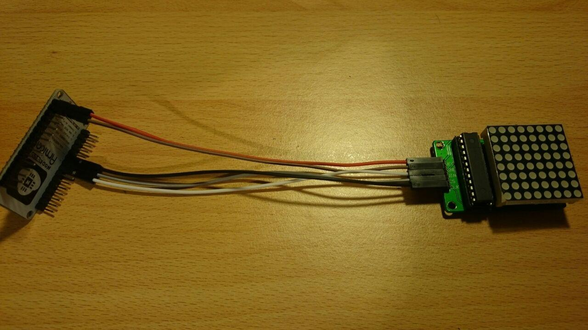

= Repo for trying out the ESP8266 chip on NodeMCU 1.0 (ESP-12E) board

== Software Requirements:

* https://www.arduino.cc/en/Main/Software[Arduino IDE]
* https://www.silabs.com/products/mcu/Pages/USBtoUARTBridgeVCPDrivers.aspx[CP2102 USB Drivers] (instructions will be updated)
** Follow instructions in zip
* ESP8266 Library:
** Add this Link to Preferences Dialog in the field "additional boards URL": http://arduino.esp8266.com/stable/package_esp8266com_index.json
** Set following settings under "Tools":
*** Board: NodeMCU 1.0
*** Upload using: Serial
*** CPU frequency: 80 MHz
*** Flash size: 4M
*** Upload speed: 115200
*** Port: your port
* https://github.com/wayoda/LedControl/releases[LedControl Library] for the LED matrices
** Apply this https://github.com/sej7278/LedControl/commit/d82d522791b805ebaebe926c45ca18a1ba35a3cc[fix] to LedControl.h contained in the zip
** Follow this http://wayoda.github.io/LedControl/[install guide]
* https://github.com/adafruit/DHT-sensor-library/releases[DHT11 Library] for the temperature and humidity sensor
** Download zip and import in Arduino IDE (Examples not working, just copy & paste instead)

== Wiring:
* Single Matrix Wiring:

